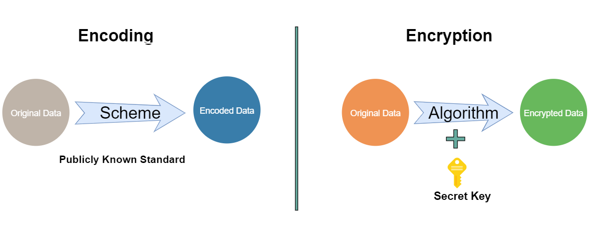
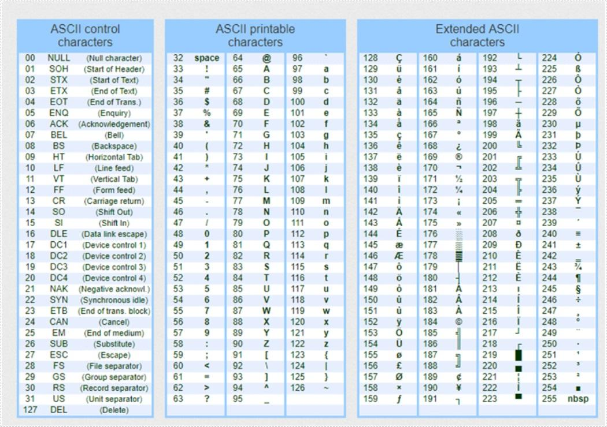
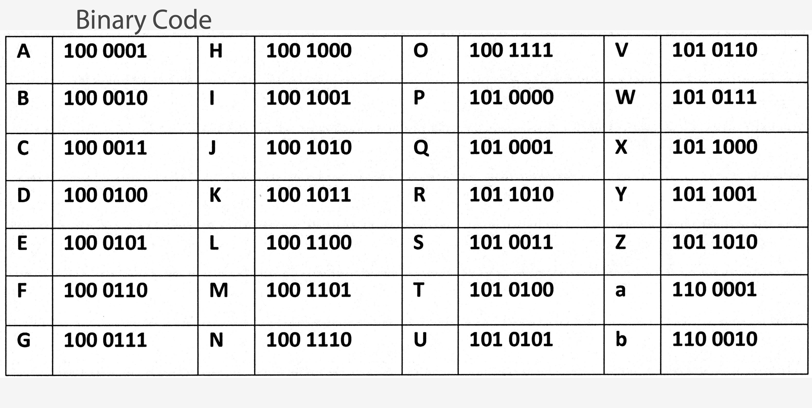
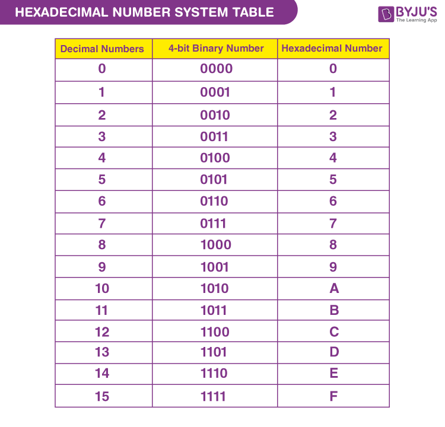
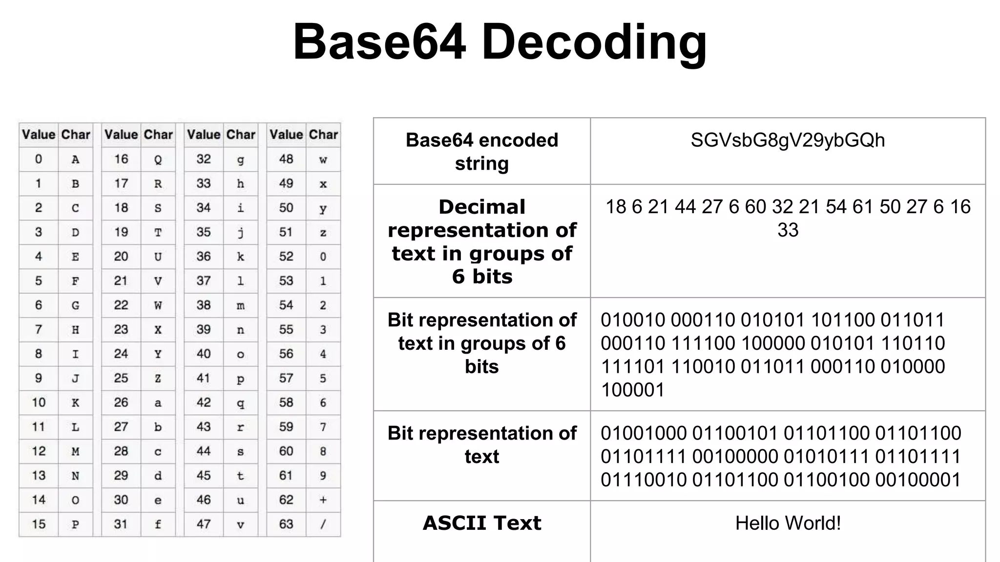
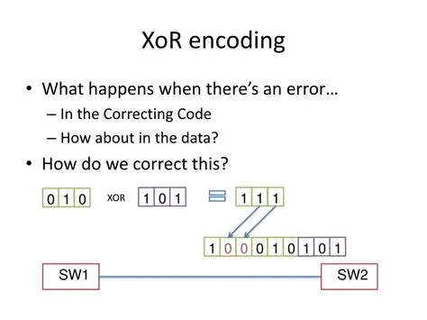

# Tìm hiểu các phương pháp Encoding và Decoding phổ biến
Encoding và decoding là các kỹ thuật được sử dụng rộng rãi trong hệ thống máy tính và truyền thông dữ liệu. Chúng giúp biểu diễn, lưu trữ và truyền dữ liệu ở những định dạng phù hợp, không nhằm mục đích bảo mật như mã hóa.

📌 Encoding luôn có thể đảo ngược, không dùng khóa và không đảm bảo bảo mật.

## 1. Encoding và Decoding là gì?

- Encoding là quá trình chuyển đổi dữ liệu từ dạng này sang dạng khác theo một quy tắc xác định, nhằm thuận tiện cho lưu trữ hoặc truyền tải.

- Decoding là quá trình khôi phục dữ liệu ban đầu từ dạng đã được encoding.

📌 Encoding luôn có thể đảo ngược, không dùng khóa và không đảm bảo bảo mật.

## 2. Các phương pháp Encoding phổ biến
### 2.1. ASCII (American Standard Code for Information Interchange)



ASCII là bảng mã dùng để biểu diễn các ký tự bằng số.

- Mỗi ký tự được biểu diễn bằng 7 hoặc 8 bit

- Tổng cộng 128 ký tự cơ bản

📌 Ví dụ:

```
'A'  → 65 (decimal) → 01000001 (binary)
```

👉 ASCII được dùng phổ biến trong văn bản và lập trình.

### 2.2. Binary (Hệ nhị phân)



Binary là cách biểu diễn dữ liệu bằng 0 và 1, là ngôn ngữ cơ bản của máy tính.

- Mỗi bit chỉ có 2 trạng thái: 0 hoặc 1

- Dùng để biểu diễn mọi loại dữ liệu

📌 Ví dụ:
```
10 (decimal) → 1010 (binary)
```

👉 Binary là nền tảng cho mọi phương pháp encoding khác.

### 2.3. Hexadecimal (Hệ thập lục phân)



Hexadecimal sử dụng 16 ký tự: 0–9 và A–F.

- 1 byte = 2 ký tự hex

- Giúp dữ liệu nhị phân dễ đọc hơn

📌 Ví dụ:
```
Binary: 11111111
Hex:    FF
```

👉 Hex thường dùng trong:

- Biểu diễn dữ liệu nhị phân

- Địa chỉ bộ nhớ

- Hash (MD5, SHA)

### 2.4. Base64



Base64 là phương pháp encoding chuyển dữ liệu nhị phân sang ký tự ASCII có thể in được.

- Không dùng để bảo mật
- Tăng kích thước dữ liệu ~33%

📌 Ví dụ:
```
"hello" → aGVsbG8=
```

👉 Ứng dụng:

- Email

- API

- Truyền ảnh, file nhị phân qua HTTP

### 2.5. XOR (Exclusive OR)



XOR là phép toán logic thường dùng trong encoding đơn giản và CTF.

📌 Bảng XOR:
| A | B | A XOR B |
| - | - | ------- |
| 0 | 0 | 0       |
| 0 | 1 | 1       |
| 1 | 0 | 1       |
| 1 | 1 | 0       |

📌 Ví dụ:
```
Plaintext XOR Key = Ciphertext
Ciphertext XOR Key = Plaintext
```

👉 XOR không an toàn, chỉ mang tính minh họa hoặc CTF.


## 3. Decoding

Decoding là quá trình đảo ngược encoding để thu lại dữ liệu ban đầu.

📌 Ví dụ:
```
Base64 decode: aGVsbG8= → hello
Hex decode:    68 65 6c 6c 6f → hello
```

## 4. Phân biệt Encoding và Encryption trong thực tế

| Tiêu chí         | Encoding          | Encryption        |
| ---------------- | ----------------- | ----------------- |
| Mục đích         | Biểu diễn dữ liệu | Bảo mật dữ liệu   |
| Có khóa không    | ❌ Không           | ✅ Có              |
| Có thể đảo ngược | ✅ Luôn            | ✅ Chỉ khi có khóa |
| Bảo mật          | ❌ Không           | ✅ Có              |
| Ví dụ            | Base64, Hex       | AES, RSA          |

> 📌 Encoding ≠ Encryption

## 5. Ví dụ thực tế dễ nhầm lẫn

- Base64 trong token, cookie → ❌ không phải mã hóa

- Hash mật khẩu → ❌ không phải encoding

- HTTPS → ✅ có mã hóa thật (AES, RSA)

> 🔎 Tổng kết
> - Encoding/Decoding dùng để biểu diễn và truyền dữ liệu
> - Encryption dùng để bảo mật thông tin
> - Không nên nhầm lẫn Base64 hay XOR với mã hóa an toàn


