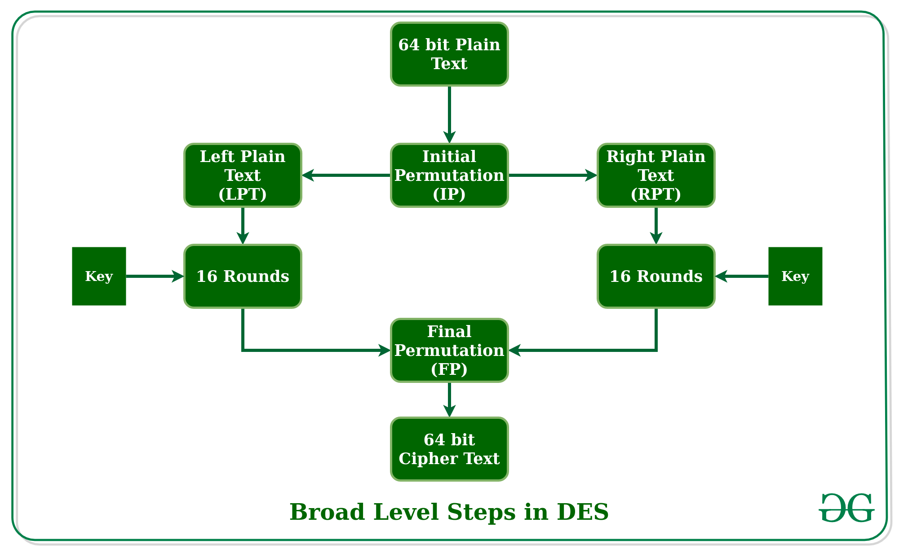
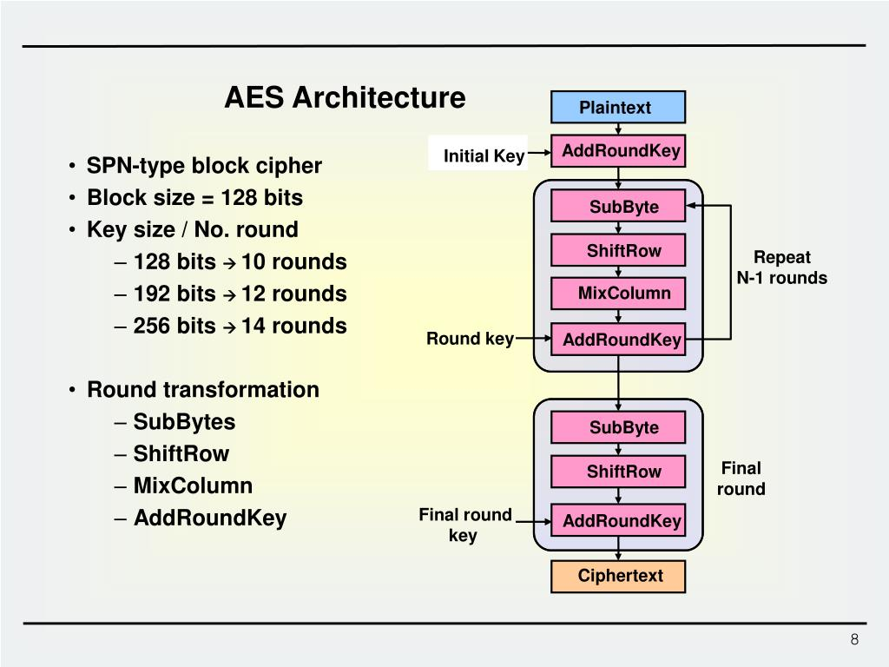

---
# Thuật toán mật mã hiện đại
Thuật toán mã hóa hiện đại là các thuật toán mật mã được thiết kế để bảo vệ dữ liệu trong môi trường số ngày nay, đảm bảo các mục tiêu cốt lõi:
- 🔒 Bí mật (Confidentiality)
- ✔️ Toàn vẹn (Integrity)
- 👤 Xác thực (Authentication)
- 🚫 Không chối bỏ (Non-repudiation)

Chúng được xây dựng dựa trên toán học hiện đại, đã qua phân tích bảo mật nghiêm ngặt, và được sử dụng rộng rãi trong Internet, ngân hàng, blockchain, VPN, HTTPS,…

## Thuật toán mã hóa hiện đại được chia làm 2 loại chính 👇
### 1. 🔐 Mã hóa đối xứng (Symmetric Encryption)

- Dùng 1 khóa duy nhất để mã hóa và giải mã

📌 Đặc điểm:
- Tốc độ rất nhanh
- Phù hợp mã hóa dữ liệu lớn
- Khó ở khâu chia sẻ khóa

📌 Ví dụ:
- AES
- DES (không còn an toàn)
- 3DES
- ChaCha20

### 2. 🔑 Mã hóa bất đối xứng (Asymmetric Encryption)

Dùng 2 khóa:
- Khóa công khai (Public Key)
- Khóa bí mật (Private Key)

📌 Đặc điểm:
- Chậm hơn đối xứng
- Giải quyết vấn đề phân phối khóa
- Dùng cho trao đổi khóa, chữ ký số

📌 Ví dụ:
- RSA
- ECC
- ElGamal

### 🔄 Bổ sung "Hàm băm mật mã" (không phải mã hóa nhưng rất quan trọng)
- Hàm băm mật mã (Cryptographic Hash)
- SHA-256, SHA-3
- MD5, SHA-1 (không an toàn)

👉 Không dùng để giải mã, chỉ để kiểm tra toàn vẹn, lưu mật khẩu.

---

> Tại sao gọi hàm băm mật mã không phải là mã hóa?

👉 Vì hàm băm KHÔNG thể giải mã ngược lại dữ liệu ban đầu.

🔑 So sánh trực tiếp: Mã hóa vs Hàm băm
| Tiêu chí         | Mã hóa (Encryption)         | Hàm băm (Hash)        |
| ---------------- | --------------------------- | --------------------- |
| Có khóa không    | ✅ Có khóa                   | ❌ Không khóa          |
| Có giải mã không | ✅ Có thể giải mã            | ❌ Không thể đảo ngược |
| Mục đích         | Bảo mật dữ liệu             | Kiểm tra toàn vẹn     |
| Đầu ra           | Có thể phục hồi dữ liệu gốc | Không thể phục hồi    |
| Ví dụ            | AES, RSA                    | SHA-256, SHA-3        |

## Tìm hiểu một số thuật toán mật mã hiện đại
### 1. Mã hóa đối xứng (DES, AES)
#### 1.1. DES (Data Encryption Standard)

DES là một trong những thuật toán mã hóa đối xứng đầu tiên được chuẩn hóa và sử dụng rộng rãi trong quá khứ.

- Độ dài khóa: 56 bit
- Hoạt động trên từng khối dữ liệu 64 bit
- Dựa trên cấu trúc Feistel

Nhược điểm:
- Độ dài khóa ngắn → dễ bị tấn công brute-force
- Hiện nay không còn được xem là an toàn

👉 DES hiện chỉ mang tính nghiên cứu và lịch sử, không nên sử dụng trong hệ thống hiện đại.

#### 1.2. AES (Advanced Encryption Standard)

AES là thuật toán mã hóa đối xứng hiện đại, được NIST chọn làm tiêu chuẩn thay thế DES.

- Độ dài khóa: 128 bit, 192 bit, 256 bit
- Kích thước khối: 128 bit
- Cấu trúc: Substitution–Permutation Network (SPN)

Ưu điểm:
- Mức độ bảo mật cao
- Tốc độ nhanh, hiệu quả
- Được sử dụng rộng rãi trong thực tế

Ứng dụng:
- HTTPS
- VPN
- Wi-Fi (WPA2, WPA3)
- Mã hóa ổ đĩa, dữ liệu hệ thống

👉 AES là thuật toán mã hóa đối xứng phổ biến và an toàn nhất hiện nay.

### 2. Mã hóa bất đối xứng RSA (Revest-Shamir-Adleman)
Mã hóa bất đối xứng là phương pháp sử dụng hai khóa khác nhau:
- Khóa công khai (Public Key)
- Khóa bí mật (Private Key)

Dữ liệu được mã hóa bằng khóa công khai chỉ có thể được giải mã bằng khóa bí mật tương ứng.

Đặc điểm:
- Giải quyết được vấn đề phân phối khóa
- Bảo mật cao
- Tốc độ chậm hơn mã hóa đối xứng

---

RSA là thuật toán mã hóa bất đối xứng phổ biến nhất hiện nay, dựa trên độ khó của bài toán phân tích số nguyên lớn thành thừa số nguyên tố.

- Độ dài khóa phổ biến: 2048 bit, 3072 bit

- Có thể dùng để:
    - Mã hóa dữ liệu
    - Trao đổi khóa
    - Tạo chữ ký số

Ứng dụng:
- HTTPS (SSL/TLS)
- Chữ ký số
- Email bảo mật
- Hệ thống xác thực

👉 Trong thực tế, RSA thường được dùng để trao đổi khóa, sau đó dữ liệu sẽ được mã hóa bằng AES để tăng hiệu năng.

> 🔎 Tổng kết
Mã hóa đối xứng (DES, AES): nhanh, dùng cho dữ liệu lớn
Mã hóa bất đối xứng (RSA): an toàn trong phân phối khóa
Các hệ thống hiện đại thường kết hợp cả hai loại để đạt hiệu quả và bảo mật cao
